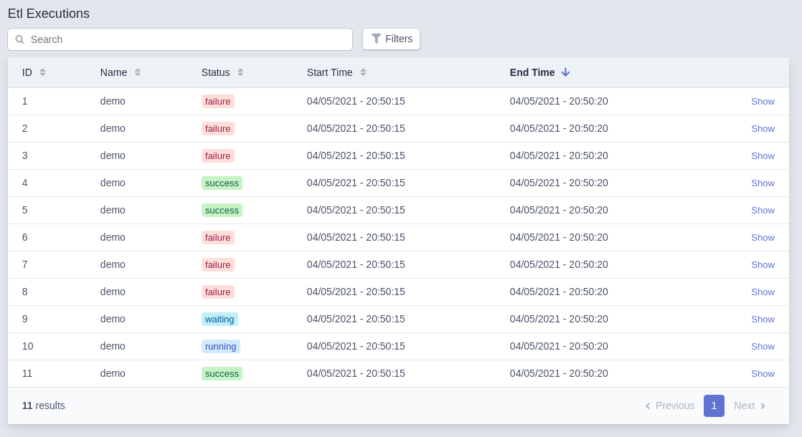
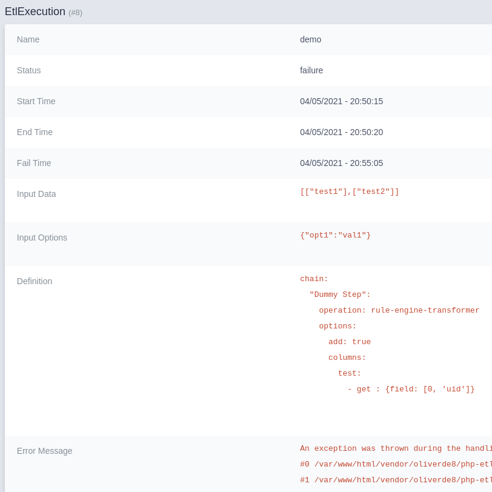

# PHP Etl Bundle

[](https://scrutinizer-ci.com/g/oliverde8/phpEtlBundle/?branch=main)
[](https://scrutinizer-ci.com/g/oliverde8/phpEtlBundle/build-status/main)
[](https://scrutinizer-ci.com/g/oliverde8/phpEtlBundle/?branch=main)
[](//packagist.org/packages/oliverde8/php-etl-bundle) 
[](//packagist.org/packages/oliverde8/php-etl-bundle) 
[](//packagist.org/packages/oliverde8/php-etl-bundle) 
[](//packagist.org/packages/oliverde8/php-etl-bundle)

The Php etl bundle allows the usage of [Oliver's PHP Etl](https://github.com/oliverde8/php-etl) library in symfony. 
Add's an integration to easy admin as well in order to see a list of the executions:



And also a details on each execution:



## Installation

1. Install using composer

2. in `/config/` create a directory `etl`

3. Enable bundle: 
```php
    \Oliverde8\PhpEtlBundle\Oliverde8PhpEtlBundle::class => ['all' => true],
```

4. Add to easy admin
```php
yield MenuItem::linkToCrud('Etl Executions', 'fas fa-list', EtlExecution::class);
```

5. Optional: Enable creation of individual files for each log by editing the monolog.yaml
```yaml
etl:
    type: service
    id: Oliverde8\PhpEtlBundle\Services\ChainExecutionLogger
    level: debug
    channels: ["!event"]
```

## Usage

### Creating an ETL chain

First read the documentation of the [PHP ETL](https://github.com/oliverde8/php-etl) 

Each chain is declare in a single file. The name of the chain is the name of the file created in `/config/etl/`. 
**Example:**
```yaml
chain:
  "Dummy Step":
    operation: rule-engine-transformer
    options:
      add: true
      columns:
        test:
          rules:
            - get : {field: [0, 'uid']}
```

### Executing a chain

```sh
./bin/console etl:execute demo '[["test1"],["test2"]]' '{"opt1": "val1"}'
```

The first argument is the input, depending on your chain it can be empty. The second are parameters that 
will be available in the context of each link in the chain. 

### Additional commands

#### Get a definition
```sh
./bin/console etl:get-definition demo
```

### Adding your own chain operation

To add your own chain operation you need 2 classes. The operation itself that we will call 
`MyVendor\Etl\Operation\OurTestOperation`, and a `MyVendor\Etl\OperationFactory\OurTestOperationFactory` factory 
to create it. The factory allows us to configure the operation and inject service to our operation.

All operations needs to implement `DataChainOperationInterface`; they can extend `AbstractChainOperation`. 

All factories needs to extend `Oliverde8\Component\PhpEtl\Builder\Factories\AbstractFactory`. 

The operation is a Model and not a service, you therefore need to add the path to the exclusions so that it's not
made a service by symfony: 
```yaml
App\:
  resource: '../src/'
  exclude:
    - '../src/Etl/Operation'
```

Factories needs to be tagged `etl.operation-factory\ . To remove the need to tag all your factories you can add 
the following line your your services.yaml file
```yaml
    MyVendor\Etl\OperationFactory\:
        resource: '../src/Etl/OperationFactory/'
        tags: ['etl.operation-factory']
```

For more information on how the etl works and how to create operations check the [Php Etl Documentation](https://github.com/oliverde8/php-etl#creating-you-own-operations)

## TODO
- Separate the easy admin section in an other bundle. Maybe not necessery.
- Add possibility to create etl chains definitions from the interface.  
- Add the possibility to queue an execution. 
